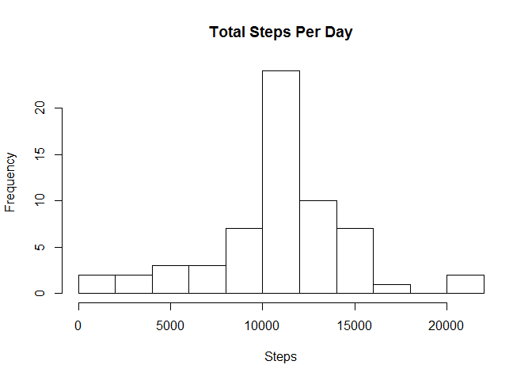

# Reproducible Research: Peer Assessment 1


## Loading and preprocessing the data

First, we load the data using read.csv() and set options suppressing scientific notation and cutting off decimal places smaller than the second.

Normally, missing value imputation would be part of preprocessing, but in this project it is part of a later section.  Therefor, we do no preprocessing for now.


```r
options(scipen=9)
options(digits=2)
data <- read.csv("activity.csv")
```


## What is mean total number of steps taken per day?

We use aggregate() with sum() to find the total number of steps taken for each value of date.  We then hist() to plot a histogram visualizing the result.

Note that where every value of steps is NA for a particular value of date, that record is discarded.  As a result, while there are 61 dates in the original dataset, only 53 dates with nonmissing records are kept and included in the histogram.


```r
steps_by_day <- aggregate(.~date, data=data, FUN=sum)

hist(steps_by_day$steps,
     main="Total Steps Per Day",
     xlab="Steps",
     breaks=10)
```

 

```r
mean_steps_by_day <- mean(steps_by_day$steps)
median_steps_by_day <- median(steps_by_day$steps)
```

Finally, we calculate the mean (10766.19) and median (10765) steps taken per day.

## What is the average daily activity pattern?

We use aggregate() to find the mean() value of steps for each value of interval and plot the result, giving us a visualization of the average number of steps taken at each time of day.


```r
steps_by_interval <- aggregate(.~interval, data=data, FUN=mean)

plot(steps_by_interval$steps ~ steps_by_interval$interval, type="l")
```

 

```r
maximum_daily_steps <- max(steps_by_interval$steps)

maximum_daily_interval <- subset(steps_by_interval,
                                 steps==maximum_daily_steps,
                                 select = interval)[,1]
```


We note that on average, the maximum number of steps taken is 206.17, and this occurs during interval 835.

## Imputing missing values

For imputing missing values, we will take the naive approach and assign the simple mean of nonmissing values.  First, we calculate this mean and declare a simple function to overwrite it onto missing values.


```r
complete_records <- subset(data, !is.na(data$steps))

mean_complete <- mean(complete_records$steps)

impute_mean <- function(x) if (is.na(x)) mean_complete else x
```


Next, we make a copy of the dataset and apply our imputation function to each record of the copy, resulting in a fully imputed dataset.


```r
data_imputed <- data

data_imputed$steps <- sapply(data_imputed$steps, impute_mean)
```


Finally, we repeat the previuous process to create a histogram of the total number of steps taken each day, now using our imputed dataset as basis.  Note that the histogram now reflects many days with all their records imputed with the mean number of steps.


```r
imputed_steps_by_day <- aggregate(.~date, data=data_imputed, FUN=sum)

hist(imputed_steps_by_day$steps,
     main="Total Steps Per Day",
     xlab="Steps",
     breaks=10)
```

 

```r
imputed_mean_steps_by_day <- mean(imputed_steps_by_day$steps)

imputed_median_steps_by_day <- median(imputed_steps_by_day$steps)
```


After calculating our imputed dataset mean (10766.19) and median (10766.19), we note that the median has changed, and is in fact equal to our imputed value.

## Are there differences in activity patterns between weekdays and weekends?

To examine the diffence between habits on weekends and weekdays, we take our imputed dataset, declare a short function specifying whether each record corresponds to a weekend or a weekday, and use that function to create a new factor variable containing that information.


```r
data_weekday <- data_imputed

data_weekday$date <- as.Date(data_weekday$date, format = "%Y-%m-%d")

weekender <- function(x){
   if (weekdays(x) == "Saturday" | weekdays(x) == "Sunday") "weekend"
   else "weekday"
}

data_weekday$weekend <- sapply(data_weekday$date, weekender)
data_weekday$weekend <- as.factor(data_weekday$weekend)
```

Next, we use aggregate() again to find the mean value of steps for each combination of interval and weekend.  This results in a dataset that contains the average numbers of steps taken during each interval separately for weekends and weekdays.


```r
data_by_weekend <- aggregate(steps ~ interval + weekend, data=data_weekday, FUN=mean)
```


Finally, we plot the weekend and weekday value of steps against interval.  This allows us to make immediate observations about the subject's habits.  For example, the subject seems to wake and start stepping regularly at about 5:30am on weekdays, but wakes less regularly on weekends, sometime in the period between 6:00am and 8:00am.

```r
library(lattice)
xyplot(steps~interval | weekend, data=data_by_weekend, type="l", layout=c(1,2))
```

 
